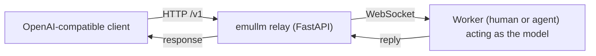

# emullm

A **simulated LLM backend relay**: it answers OpenAI-compatible API requests
and the Anthropic Messages API-compatible `/v1/messages` endpoint by relaying
them, in real time, over a WebSocket to a connected worker (a human or an
agent) acting as the model -- instead of calling a real model API.

This is the standalone extraction of the `emullm` feature (originally
built inside a larger workbench). It runs as its own FastAPI service on
its own port.

## How it works



- A client calls the keyless `/v1/*` surface, including OpenAI-compatible
  endpoints and Anthropic Messages API-compatible `/v1/messages`.
- The relay forwards each request over a WebSocket to a connected worker.
- The worker (a person or an agent) answers as if it were the model, and
  the reply is streamed back to the client.

Uvicorn/Starlette owns the socket transport. Each worker WebSocket is an
asyncio task on the server event loop, not a Python thread. Blocking
servant-process and filesystem inspection is explicitly offloaded with
`asyncio.to_thread`; the WebSocket awaits themselves remain non-blocking.

## Quick start

Assumes Python 3.12+ is installed (see
[Installing prerequisites](#installing-prerequisites) if not).

> **You most likely need a GitHub Copilot account.** The relay itself is
> keyless, but its built-in **headless Copilot servants** answer requests by
> driving the [GitHub Copilot CLI](https://docs.github.com/copilot), which
> requires an active **GitHub Copilot subscription** (individual, Business, or
> Enterprise) and a one-time `copilot` (or `gh copilot`) login on this machine.
> Without it, you can still run the server and connect your own human/agent
> workers, but the bundled `worker-copilot-*` servants and the `copilot/<model>`
> backends will not start.

Windows (PowerShell):

```powershell
py -m venv .venv
.\.venv\Scripts\Activate.ps1
python -m pip install -e ".[test]"
python -m emullm.standalone     # serves on http://127.0.0.1:8801
```

macOS/Linux:

```bash
python3 -m venv .venv
source .venv/bin/activate
python -m pip install -e ".[test]"
python -m emullm.standalone     # serves on http://127.0.0.1:8801
```

Then, in a second terminal with the environment activated, connect a
worker and open the chat client:

```console
python -m emullm.worker --host-ws-url ws://127.0.0.1:8801
python -m emullm.chat
```

Point any OpenAI-compatible client at `http://127.0.0.1:8801/v1`. **No API
key or token is required.**

## Run the relay

```console
python -m emullm.standalone     # serves on http://127.0.0.1:8801
```

Then point any OpenAI-compatible client at `http://127.0.0.1:8801/v1`.
**No API key or token is required** -- the `/v1/*` surface is keyless. If
your client SDK forces an `api_key` / `OPENAI_API_KEY` value, use any
placeholder (e.g. `sk-no-key-required`); the server ignores
`Authorization` headers. Press `Ctrl+C` to stop the service.

## Connect a worker

Open a second terminal in the project folder and activate the virtual
environment there as well. For example, in Windows PowerShell:

```powershell
.\.venv\Scripts\Activate.ps1
```

Then connect a servant:

```console
python -m emullm.worker --host-ws-url ws://127.0.0.1:8801
```

Every native servant uses the one endpoint:
`ws://127.0.0.1:8801/emullm/ws`. Supply an optional identity as
`?worker_id=worker-copilot-1`; if omitted, the server names the connection
`worker-unknown-<ip>-<port>` after its client address (falling back to a random
suffix when the address is unavailable or already taken) and returns it in the
first `hello` frame. A worker may (re)declare its name at any time by sending
`{"type":"identify","worker_id":"<name>"}` (the `register` frame's `worker_id`
does the same); the server replies with a `renamed` frame. A name that is
already connected is **not** rejected -- the worker is admitted as a *fallback*
under a derived id (`<name>-2`, `<name>-3`, ...) and joins that name's *team*, so
a conflicting name forms a fallback pool (the `hello`/`renamed` frame then
carries `team` and `fallback` fields). Addressing a team name reaches the whole
team, primary first. Supply an optional comma-separated glob list as
`?worker_id=worker-copilot-1&modelmasks=openai/*,gpt-*`; omitting `modelmasks`
makes the servant eligible for every model. Unlisted model IDs are always
forwarded unchanged in the request frame. A servant may explicitly send
`accept` then `reply`, send `reject` for a semantic/capability refusal, or send
`not_ready` with `retry_after` for a transient runtime failure. `not_ready`
records `LLM_NOT_READY`, advances to another route candidate immediately, and
cools that worker only until it should be tried again. A `reject` records
`LLM_REJECT` and lets the relay try another eligible servant.

EMULLM advertises its own current HTTP and WebSocket routes at
`GET /emullm/endpoints`. The catalog always contains the single shared
worker route `/emullm/ws`; worker connections do not create new paths. Every
catalog entry includes its comment, query/path/header parameters, request-body
schema, and response metadata. Reusable component schemas are returned in the
top-level `schemas` map.

The Workbench manifest declares the aggregate server event log at
`GET /emullm/websock_to_llm_user/events` and two selectable runtime modes:
`standalone` (the default server at `http://127.0.0.1:8801`) and `embedded`
(the router mounted at `/emullm`). The selected `runtimeModes.current` value
maps to `EMULLM_PLUGIN_MODE` and takes effect on the next Workbench/API restart.

The worker connects, waits briefly for a relayed request, answers it, and
rests -- see `docs/EMULLM_ONBOARD.md` for the complete worker doc (the
only file a worker ever sees): the full how-to plus the required
persistent-engagement doctrine and heartbeat automation (100% engaged,
never ending its turn, revived only by a recurring native automation --
no scripts, schedulers, or watchdogs). `docs/EMULLM_RELAY.md` has the
complete design and route map.

To have an agent (rather than a human) act as the worker, install the
GitHub Copilot CLI or OpenAI Codex CLI -- see
[Agent worker CLIs](#optional-agent-worker-clis).

## Headless Copilot servants

Open `http://127.0.0.1:8801/emullm/admin` and use **Headless Copilot
servants** to create and manage unattended Copilot-backed answerers. Each
servant:

- connects to the shared `WS /emullm/ws` worker endpoint;
- accepts only its configured `modelmasks` (or every model when empty);
- starts one resident Copilot SDK/CLI runtime and reuses it for every request;
- reuses one stable session, preserving that servant's conversation across
  OpenAI-compatible API calls;
- schedules an ordinary short conversational interaction every 40 seconds by
  default, rotating an editable catalog initially populated with 50 prompts;
- persists its configuration under `headless_copilots` in `config.json`;
- converts admin-uploaded images, audio, and arbitrary files into native
  Copilot SDK blob attachments;
- writes adapter output to `runtime/headless_copilots/<worker_id>/servant.log`.

The same complete operations console is also served at `GET /emullm` and
`GET /emullm/`; `/emullm/admin` remains the explicit administration path.
This follows the plugin convention: `GET /<prefix>` is the primary admin UI,
while `GET /<prefix>/admin` is the unambiguous explicit alias used by plugin
API metadata.

The admin and status dashboards poll every three seconds only while visible.
Their persisted polling policy can run continuously or automatically pause
after one, two (the default), or five minutes. **Wake / refresh** starts a new
polling window immediately. Hidden pages stop polling unless **HIDDEN / 2 MIN**
is enabled, in which case they make one lightweight refresh every two minutes.
`GET /emullm/admin/health` provides the filesystem-free readiness snapshot used
by rollout automation; the complete `/emullm/admin/state` snapshot uses cached
JSONL metadata instead of deserializing entire mailbox histories.

Standalone process controls are loopback-only:

- `POST /emullm/admin/restart` gracefully replaces the server while preserving
  connected servant processes when possible; they reconnect to the replacement
  and only missing autostart workers are launched.
- `POST /emullm/admin/shutdown` gracefully stops servants and the server.
- `POST /emullm/admin/copilots/bulk/restart` restarts servants in rolling,
  concurrent batches of seven by default. `batch_size=1..50` may override the
  batch size. Each batch waits for its servants to reconnect before the next
  batch starts, preserving usable capacity without serializing all 21 workers.

Embedded mode returns `409` because a plugin must not terminate its host
Workbench process.

The resident runtime starts before its worker WebSocket is advertised. Warmup is
role-driven rather than a GUI checkbox: baseline/manual and idle-reserve workers
send `warmup_prompt` once before connecting; demand replicas skip warmup to
serve immediately. The admin table shows adapter, SDK bridge, and owned CLI PIDs
plus warmup and last model-call durations.

The model sees these as normal chat, not as a keepalive. Prompts include brief
session/request-type check-ins and harmless WebSocket/API jokes. Tasks never use
tools, have a configurable hard maximum of ten seconds, and are immediately preempted by
client work. Each worker/model tracks per-task attempts, average/max duration,
and timeouts. A task is retired after two consecutive outcomes at or above eight
seconds (including timeouts), while at least one fallback task always remains;
model switching starts a fresh ranking.

The GUI's **Refresh models** button queries the authenticated account through
Copilot's bundled SDK `models.list` API. When `model` is blank, each servant
uses `model_selector` over its optional `model_pool`, or over the complete
discovered catalog when that pool is empty:

- `random` chooses from all eligible models.
- `best-N` chooses randomly among the highest-ranked N (`best-1` is
  deterministic).
- `worst-N` chooses among the lowest-ranked N; `worse-N` is accepted as an
  alias.

The rank is an explicit best-to-worst quality heuristic shown in the model
dropdown/API as `quality_rank` and `quality_tier`; an explicit `model` always
wins. A configured `reasoning_effort` filters selector candidates to models
whose SDK metadata supports that level. It may also be `random`, `most-N`, or
`least-N`; these resolve after model selection using that model's supported
effort ordering (`none`, `minimal`, `low`, `medium`, `high`, `xhigh`, `max`).
For example, `most-1` chooses the highest supported effort and `least-1` the
lowest. If live discovery is unavailable, EMULLM falls back to the initial
model list shown in the Copilot desktop picker. Selecting a model in the
servant editor displays its SDK-reported context, prompt, output, vision,
tool-use, streaming, structured-output, reasoning, and billing capabilities.

When a caller sends more input than the selected servant model can accept,
`chunk_long_prompts: true` ingests the request sequentially and asks for one
final answer after all chunks. The default chunk budget comes from the
selected model's SDK context metadata and the servant's `default` versus
`long_context` setting; `chunk_tokens` overrides it, `max_chunks` bounds the
work, and `max_prompt_chars` remains the absolute request safety limit.

Servants now default to the explicitly requested **full-access** profile:
long-prompt chunking, all tools/paths/URLs, repository instructions, and
built-in MCPs are enabled. Remote session access remains disabled. This is
deliberately unsafe because `/v1/*` callers can supply arbitrary prompts; edit a
servant configuration through the API/raw JSON if a restricted profile is
required.

The same controls are available through REST:

```text
GET    /emullm/admin/copilots
POST   /emullm/admin/copilots
GET    /emullm/admin/copilots/{worker_id}
PUT    /emullm/admin/copilots/{worker_id}
DELETE /emullm/admin/copilots/{worker_id}
POST   /emullm/admin/copilots/{worker_id}/start
POST   /emullm/admin/copilots/{worker_id}/stop
POST   /emullm/admin/copilots/{worker_id}/restart
POST   /emullm/admin/copilots/{worker_id}/reset-session
GET    /emullm/admin/copilots/{worker_id}/log
GET    /emullm/admin/copilots/schema
GET    /emullm/admin/copilots/models
POST   /emullm/admin/test-chat
DELETE /emullm/admin/test-chat/{request_id}
POST   /emullm/admin/copilots/bulk/{start|stop|stop-idle|restart|reset-session}
```

For example:

```json
{
  "worker_id": "copilot-openai",
  "model": "gpt-5-mini",
  "model_pool": [],
  "model_selector": "random",
  "modelmasks": ["openai/*", "gpt-*"],
  "autostart": true,
  "system_prompt": "Answer as the requested OpenAI-compatible model.",
  "context": "default",
  "timeout_seconds": 900,
  "allow_all": false
}
```

Send that object to `POST /emullm/admin/copilots?start=true`. A session UUID
is generated and persisted automatically. Use `reset-session` when you
intentionally want to discard the servant's accumulated Copilot context.

The default identity is `worker-copilot-1`; additional servants created in
the GUI are persisted and autostart according to their own settings. Their
models are intentionally unspecified by default, so each start chooses a
random available Copilot model. Every configured model route uses this ordered
failover convention:

```json
[
  "worker-copilot-*",
  "worker-codex-*",
  "https://llm.a.singularitycompute.com/v1"
]
```

Worker targets are globbed against currently connected worker IDs. The first
group that answers wins; rejected or unavailable workers fall through to the
next group, and the final URL is called as an OpenAI-compatible backend.
`GET /v1/models` includes these configured simulated IDs even when they are not
native backing-model IDs. Each connected managed servant also advertises a
stable direct alias such as `worker-copilot-1/gpt-5.6-sol`, with worker kind,
active backing model, description, and backing-model capability metadata.
It additionally exports every model returned by the authenticated Copilot SDK
catalog as `copilot/<model-id>` (for example `copilot/gpt-5.6-sol`). Requesting
one lazily creates or reuses an elastic `worker-copilot-N` servant pinned to
that exact backing model. `max_concurrent_calls` is configurable from 4–50
(21 in the workbench plugin configuration), so the four baseline servants can expand through
`worker-copilot-5..50`. Busy matching models get replicas; idle elastic sessions
may switch models in place through the SDK's `session.setModel()` while
preserving conversation history. EMULLM also attempts to keep
`idle_worker_target` workers idle and connected (default 5).
One HTTP client may consume at most the connected fleet minus the larger of
five workers or 30 percent of the fleet. Excess requests wait at the client
capacity gate, preserving workers for independent clients and prompts.

`emullm/default` is always exported as a stable alias to the current
`services.model` default (or `worker-copilot-n/percent100` when none is configured).
Giving that alias its own `route_targets` in the Models configurator overrides
the resolved default route.

A client may also address a target **directly** in the model id, with no
configured `model_routes` entry: `worker-<id>/<served>` sends the request
straight to that connected worker, and a `backend-<name>` token sends it
straight to that named backend (from config `backends`). The token is found by
**scanning** the model id for a configured backend/agent name and removing it;
whatever is left becomes the served model id forwarded upstream. The **longest
configured name** wins, so with backends `snet` and `snet-other`,
`backend-snet-other-foo` resolves to backend `snet-other` serving `foo`. Both
the slash form `backend-snet/openai/foo` (served `openai/foo`) and the slashless
dash form `backend-snet-asi1` (served `asi1`) work. A bare `backend-<name>` (or
`.../same`) forwards the backend's configured `model`.

The token may appear **anywhere** at a start-of-string or post-`/` boundary, and
the text on either side is stitched back together, so a provider prefix is
preserved: `openai/backend-snet-asi1` routes to backend `snet` forwarding
`openai/asi1`. Slashes are opaque boundaries the scan never sees through: the
`backend-<name>` token must be contiguous (dash-joined), so
`backend/snet-openai-foo` never resolves to backend `snet`. Direct backend
addressing skips the wait-for-a-worker fallback delay and returns `503` if no
configured backend name matches.

The aggregate catalog hides `yourself/*` and every concrete
`worker-copilot-<number>/*` entry, including workers created later. It advertises
only `worker-copilot-n/{percent125,percent100,percent25}` for the pool. Literal
`n` is sticky by client IP plus a 1024-port source range, and the response header
`X-EmuLLM-Worker-ID` reveals the assigned concrete worker. A direct positive
numeric worker ID may be any number; a missing one is created with a fresh
persistent session but remains private.

Capability routers use `router/<capability>-best` and
`router/<capability>-worse` for audio, video, vision, file, code,
summarization, image generation, and image output. They choose the highest- or
lowest-ranked connected worker explicitly advertising the required capability.

`POST /v1/chat/completions` accepts standard OpenAI multimodal message content,
including `image_url` data URLs and
`{"type":"input_audio","input_audio":{"data":"<base64>","format":"wav"}}`.
EMULLM decodes and stores each inline image/audio input, then sends only a
compact cloud URL and `{file_id, name, mime_type, bytes}` record over
`WS /emullm/ws`. A managed servant fetches those exact bytes locally and
supplies them to its resident Copilot session as a native SDK blob. Base64 media
is therefore present on the client HTTP request but never copied into WebSocket
or event-log frames. Images and audio each allow up to 12 inputs, 25 MiB per
input and 50 MiB total; accepted audio formats are WAV, MP3, FLAC, M4A, OGG, and
WebM.

Media requests add `required_capabilities` to the worker offer. Automatic and
worker-glob round-robin routes order servants that declared every requirement
first, retain undeclared/unknown servants as fallback candidates, and skip
explicit opt-outs. A capable servant that rejects or disconnects still advances
the request to the next candidate; a transient `not_ready` also advances but
keeps the servant eligible after its cooldown. Managed-servant `capabilities` may include
`audio_input`, `vision_input`, or other names; prefix a name with `!` or `-` to
declare an opt-out and reject a direct incompatible offer before accepting it.
Vision input is also inferred from the selected Copilot model's SDK media list.
The configurator's route shortcuts map literally to `worker-in-name`,
`worker-copilot-*`, `worker-codex-*`, `worker-unknown-*`, and `backend-*`.
The first resolves the worker prefix embedded in a model ID; `backend-*`
round-robins configured named backends, while dynamically rendered checkboxes
such as `backend-snet` select one named backend. Every worker glob still applies
capability ordering and excludes explicit opt-outs.
Capabilities are extensible task tags as well as media flags. Chat requests may
send `required_capabilities` such as `["code"]` or `["summarization"]`; the
configurator exposes both checkboxes, and arbitrary names can still be edited in
the model JSON or servant capability list. Codex remains a worker/provider route
(`worker-codex-*`), not a capability.

The same admin page also provides:

- a **Models configurator** driven by `GET /v1/models?hidden=true`. Select any
  exported or `[unexported]` model to edit its effective JSON, clear/check
  **Export in `/v1/models`**, toggle on-demand,
  simulated, image, audio, and general-file flags, edit its ordered
  `route_targets`, choose common servant/backend targets, reset the override,
  or proactively load a `copilot/<model-id>` into an on-demand slot. Overrides
  persist in `model_catalog_overrides`, while routes persist in `model_routes`;
- **Request telemetry** shows active and waiting calls, served/deferred/rejected
  totals, worker/relayed-backend and team average client time, service-kind timing, and request
  counts/timing by model. Worker/model tables are sortable, show four rows by
  default, and have selectable cumulative-total/weighted-average footers.
  Requests active on one worker for 120 seconds are listed as **Stuck workers**;
  servant reconnect counts and latest connection errors appear beside them.
  Per-worker and team model-switch counts are included. Backend targets are delayed by
  `backend_fallback_delay_seconds` (default 5) and used only as a last resort;
  configured backends such as `backend-snet` remain visible with zero-valued
  statistics before their first relay.
- a **Model test client** that combines live, advertised, and explicitly
  routed model IDs while still accepting any free-form model ID; its separate
  dropdown overwrites the text field when selected, it displays live elapsed
  seconds, displays the selected model's resolved capabilities/routes, and
  accepts up to 12 drag-and-drop or selected image, audio, video, and general
  files (25 MiB each, 50 MiB total). Uploaded bytes are stored once behind
  `/emullm/cloud/files/{file_id}`; compact metadata travels over the worker
  WebSocket, then managed Copilot servants fetch and convert it to native SDK
  blob attachments. Test-client filenames are anonymized as `attachment-1`,
  `attachment-2`, and so on before the HTTP request leaves the browser, and the
  server regenerates those names before storage/relay as a second guard. Cancel
  aborts the active SDK message while keeping the
  resident Copilot runtime ready for the next request;
  the attachment area also includes one-click American-flag, ascending-tone,
  Twinkle melody, and spoken-phrase WAV samples;
  it also includes an **Image generation test** targeting
  `copilot/gpt-5.3-codex`. Codex/code-family catalog entries declare the
  distinct `image_output` capability and can use enabled tools to create a
  workspace PNG; the test labels worker-generated output separately from the
  simulated placeholder.
- an **Enable Carol mock worker** checkbox, persisted immediately to
  `agents[].enabled`;
- **Connected WebSockets → List / refresh**, covering worker, mailbox, and
  aggregate interaction sockets with endpoint, identity/subscriptions, client
  address, connection age, successful JSON messages in/out, and the exact time
  plus elapsed age of each worker socket's last satisfied interaction and last
  real client completion. Every worker row links to its rolling JSONL frame log
  under the OS temporary directory: an immutable initial 2 MiB segment plus
  rotating previous/current 2 MiB tail segments. This retains the first 2 MiB
  and newest 4 MiB (6 MiB maximum). Base64 media is summarized rather than
  copied into the log; the combined viewer inserts JSONL boundary records showing
  exactly where each segment begins and prepends the worker's startup/system
  prompt before all segment content. Every record has an ISO timestamp, exact
  nine-decimal epoch string, and nine-decimal monotonic precision-clock value.
  A live viewer renders EMULLM/client prompts on the left and worker/model
  replies on the right at up to 80% width; autoscroll defaults on and switches
  off when the user scrolls. Base64 image/audio frame fields are extracted into
  bounded temporary artifacts so the corresponding bubble shows an image or
  native audio player without expanding the JSONL;
- **Anti-idle conversation prompts**, with shared enabled/frequency/timeout/slow
  budget configuration persisted in `config.json`, an editable catalog that can
  grow beyond 50, per-row deprecation checkboxes, Reload/Save/Reset-stats
  controls, and sortable number/average/shortest-worker/longest-worker/attempt/
  timeout/over-budget/retirement/conversation columns;
- **FastAPI requests**, listing active/recent `/v1/*` requests and logical HTTP
  client sessions. Clients may send `X-EmuLLM-Client-ID`; otherwise identity is
  grouped by remote host and User-Agent.
- **Backends**, a dedicated add/edit/delete page for both direct `backends[]`
  records and existing `launch: proxy` agents such as `snet`. Editing a proxy
  preserves its service catalogs and other advanced metadata; inline API keys
  are write-only on this page.
- **Codex suppliers**, a dedicated supplier catalog seeded with the enabled
  `copilot` supplier. Supplier model patterns annotate matching exported Codex
  models with their configured supplier ID.
- a validated **Configuration sections** editor for `services`, `agents`,
  `model_routes`, `workers`, `mock_workers`, `backends`, and `mock`. Each
  section saves independently through
  `PUT /emullm/admin/config/section/{section}` so unrelated settings are
  preserved; the full raw JSON editor remains available for advanced changes.

## Worker mailboxes

Each connected worker WebSocket is exported as a durable mailbox with the
same id as its `worker_id`. Mailbox configuration and reader cursors persist
at `runtime\config\mailboxes.json`; each worker's ordered event stream
persists at `runtime\events_logs\<worker_id>.jsonl`.

The server also writes every `LLM_USER ↔ worker_id` offer, accept, reject, and
reply to the aggregate JSONL mailbox
`runtime\events_logs\websock_to_llm_user.jsonl`. Read filtered history at
`GET /emullm/websock_to_llm_user/events` or stream it from
`WS /emullm/websock_to_llm_user/ws`; both support `worker_id`, `model`,
`modelmask`, `type`, and `after` filters/cursors.

The compatibility API is mounted at `/ws_collab/v1` and `/mailbox_chat/v1`
(with `/emullm`, `/api`, and bare-path aliases). `mailbox_chat` can use
that shared contract as an adapter for another chat service while emullm keeps
the worker relay protocol intact. It provides mailbox discovery, agents,
messages, sends, cursors, typed events, and stream tails:

```text
GET  /ws_collab/v1/mailbox/mailboxes
GET  /ws_collab/v1/events?stream=<worker_id>
GET  /ws_collab/v1/mailbox/messages?mailbox=<worker_id>
POST /ws_collab/v1/mailbox/send
```

For an adapter that needs live delivery, connect to
`ws://127.0.0.1:8801/ws_collab/ws` (aliases: `/mailbox_chat/ws`,
`/mailbox/ws`, `/emullm/mailbox/ws`) and send:

```json
{"type":"subscribe","streams":["<worker_id>"],"cursors":{}}
```

The socket catches up from the durable event log and then emits
`{"type":"event","event":{...}}` frames as relay traffic arrives.

Regular `/v1/*` model calls emit correlated `LLM_REQUEST` and `LLM_REPLY`
events into that worker mailbox. Use `POST /mailbox/send` for durable
mailbox-chat entries; use `/v1/*` to invoke the worker as a model.

## Using the API

### Chat from the command line

After starting the service and connecting a worker, open another terminal and
run the interactive client:

```powershell
python -m emullm.chat
```

Each request includes the earlier user and assistant messages, allowing the
LLM to continue the same contextual conversation. The client supports
`/history`, `/clear`, `/help`, and `/quit`. To preserve the conversation across
restarts, provide a history file:

```powershell
python -m emullm.chat --history-file runtime\conversation.json
```

For one request with no conversation history, add `--one-shot`; the client
exits after printing the response:

```powershell
python -m emullm.chat --one-shot "Summarize this project"
```

Running `python -m emullm.chat --one-shot` without a prompt keeps the input
loop open, but treats every line as an independent request with no prior turns.

It also works with other OpenAI-compatible services:

```powershell
python -m emullm.chat --base-url http://localhost:1234/v1 --model my-model
```

Use `--api-key` or the `OPENAI_API_KEY` environment variable when the remote
service requires authentication. After reinstalling this package, the same
client is available as `emullm-chat`.

### Local platform API emulation

The relay stores uploaded file metadata and bytes under `runtime/files` and
implements multipart upload, cursor-paginated list, metadata retrieval, range
downloads, expiration, upload-size enforcement, and deletion:

```powershell
curl.exe http://127.0.0.1:8801/v1/files `
  -F "purpose=fine-tune" `
  -F "file=@examples/fine_tuning/training.jsonl"
```

Use the returned `file-...` ID with `GET /v1/files/{file_id}`,
`GET /v1/files/{file_id}/content`, or `DELETE /v1/files/{file_id}`. Files are
genuinely persisted and downloadable. The default individual upload limit is
512 MB; override it with `EMULLM_MAX_FILE_BYTES`. Batch-purpose files expire
after 30 days unless an explicit `expires_after` policy is supplied.

The other existing platform resources use the same atomic, filesystem-backed
record store:

- `/v1/assistants`: create, cursor-list, retrieve, modify, and delete.
- `/v1/threads`: create, cursor-list, retrieve, modify, and delete.
- `/v1/fine_tuning/jobs`: validate fine-tuning-purpose JSONL files, create and
  retrieve jobs, list failure events and checkpoints, and reject cancellation
  once the locally unsupported job has reached its terminal `failed` state.

Server-owned IDs, object types, and creation timestamps cannot be overwritten
by request data. These resources survive restarts and the list endpoints use
stable cursor ordering. Assistants and threads provide resource lifecycle
compatibility, not a hosted agent runtime; fine-tuning remains unavailable.

Text endpoints include usage fields and support `stream: true` over SSE.
Embeddings, moderation, images, transcription, and speech are intentionally
synthetic: embedding vectors are deterministic, moderation defaults safe,
images are a valid 1-pixel PNG, transcription requires a multipart audio file,
and speech returns a valid silent WAV marked with
`X-EMULLM-Synthetic: true`.

### Real fine-tuning API examples

The runnable examples under [`examples/fine_tuning`](examples/fine_tuning)
show how to upload JSONL data, create and monitor a supervised fine-tuning job,
cancel a job, and call the resulting model using Python or PowerShell. They
target the real OpenAI API and may incur charges. This relay's local
`/v1/fine_tuning/jobs` route validates the uploaded JSONL and durably records
the job, but returns `status: "failed"` with
`error.code: "training_not_available"`; it does not train a model.

### Docs are served live

Once running, the docs are served by the app itself, all under one prefix:

- `GET /emullm/docs/EMULLM_ONBOARD.md`
- `GET /emullm/docs/EMULLM_RELAY.md`
- `GET /index.html` (static landing page)

## Configuration

Most behavior is tunable without touching code, through environment
variables and command-line flags; a few deeper defaults live as constants
in the source.

### Environment variables

Server / relay (read by `emullm.api`):

| Variable | Default | Controls |
| --- | --- | --- |
| `EMULLM_RUNTIME_DIR` | `runtime/` (next to the package) | Where uploaded files, platform records, and tokens are stored. |
| `EMULLM_MAX_FILE_BYTES` | `536870912` (512 MB) | Max size of a single `/v1/files` upload. |
| `EMULLM_MAX_AUDIO_BYTES` | `26214400` (25 MB) | Max size of a transcription audio upload. |
| `EMULLM_RATE_LIMIT_WINDOW_SECONDS` | `60` | Length of the per-worker rate-limit window. |
| `EMULLM_RATE_LIMIT_PER_WINDOW` | `20` | Max relayed requests per worker per window. |

Modes, mocking, and proxy (read by `emullm.api` / `app`):

| Variable | Default | Controls |
| --- | --- | --- |
| `EMULLM_MODE` | `relay` | Run mode (`auto`/`mock`/`proxy`/`proxy-observe`/`error-when-empty`/…). Config `mode` also applies. |
| `EMULLM_CAPABILITY_FALLBACK` | `stub` | Non-text services when no agent can serve: `stub` (fake) / `wait` (hold→504) / `error` (503). Config `capability_fallback` also applies. |
| `EMULLM_CONFIG_FILE` | `config.json` (repo root) | Path to the config document the admin page edits. |
| `EMULLM_SUBAGENT_LAUNCH` | `copilot` | `auto` mode: worker type for discovered subagents (`copilot`/`worker`/`recruit`/argv). Config `subagent_launch` also applies. |
| `EMULLM_MOCK_REPLY` | *(unset)* | `mock` mode: return exactly this string. |
| `EMULLM_MOCK_TEMPLATE` | `mock: {prompt}` | `mock` mode: `str.format` template (`{prompt}`/`{model}`/`{persona}`). |
| `EMULLM_PROXY_BASE_URL` | *(unset)* | Fallback proxy backend base URL when config has no `backends`. |
| `EMULLM_PROXY_API_KEY_ENV` | *(unset)* | Name of the env var holding the proxy backend's API key. |
| `EMULLM_PROXY_MODEL` | *(unset)* | Model id to send to the proxy backend. |

Chat client (`emullm.chat`):

| Variable | Default | Controls |
| --- | --- | --- |
| `EMULLM_BASE_URL` | `http://127.0.0.1:8801/v1` | Default API base URL. |
| `EMULLM_MODEL` | `worker-copilot-n/percent100` | Default model id. |
| `OPENAI_API_KEY` | *(unset)* | API key when pointing the chat client at a real service. |

### Command-line defaults

- **Server** (`python -m emullm.standalone` / `python plugin.py` / `emullm-serve`):
  `--host` (`127.0.0.1`), `--port` (`8801`), `--reload` (development autoreload;
  off by default). Positional `host port` are also accepted
  (`python -m emullm.standalone 127.0.0.1 8801`).
- **Worker** (`python -m emullm.worker`): optional `--worker-id` (server
  assigns one when omitted), `--modelmasks` (comma-separated glob patterns;
  omitted means all models), `--host-ws-url` (`ws://127.0.0.1:8801`),
  `--idle-timeout` (`10`s), `--rest-seconds` (`30`s), `--rest-min-seconds`
  (`1`s), `--reply-timeout` (`3600`s), `--request-file`, `--reply-file`,
  `--once`.
- **Chat** (`python -m emullm.chat`): `--base-url`, `--model`, `--api-key`,
  `--system`, `--history-file`, `--one-shot`, `--timeout` (`900`s).

### Source constants (require a code edit)

These live in `emullm/api.py`:

- `_REQUEST_TIMEOUT_SECONDS` (`900`) — how long a relayed request waits for a
  worker to reply before returning `504`.
- Batch-file default expiry — `30 * 24 * 60 * 60` (30 days) in
  `_expires_at_from_form`, applied to `purpose="batch"` uploads that don't
  send an explicit `expires_after`.
- `_ALLOWED_FILE_PURPOSES` — the accepted `purpose` values for `/v1/files`.
- `_DEFAULT_MODEL_ID` (`worker-copilot-n/percent100`) is the public virtual
  default. Literal `n` is sticky by client IP and 1024-port source range; the
  chosen numeric worker is returned in `X-EmuLLM-Worker-ID`.

## Tests

With the virtual environment active, run:

```console
python -m pytest -q
```

## Run modes (test matrix)

A checklist of run configurations for exercising the relay. Every mode
starts the server; they differ in **who plays the model** and **what
happens when no worker is available**. Names are suggestions for a future
`--mode` flag.

### Base modes

| Mode | What it does | Status |
| --- | --- | --- |
| `self` | Use the single worker you connect yourself. | ✅ tested |
| `auto` | Spawn auto-configured subagents (Copilot by default) from `./subagents/` or config, then use them. | ✅ tested |
| `recruit` | Use helper worker(s) already connected; don't wait. | ✅ tested |
| `mock` | Pretend a worker was present at the websocket and the exchange succeeded (deterministic reply, no real agent). | ✅ tested |
| `proxy` | Forward requests to a real OpenAI-compatible backend. | ✅ tested |
| `proxy-observe` | Forward to a real backend, mirroring the exchange to a connected worker. | ✅ tested |
| `error-when-empty` | Fail fast (503) when no worker is connected. | ✅ tested |
| `wait` | Hold requests until a worker connects (504 on timeout). | ✅ tested |
| `wait-then-serve` | Hold until a worker connects, then let it answer. | ✅ tested |

**Worker types (who answers).** Three kinds of agent can act as the model
(plus `mock`, the one deliberate fake):

- an **interactive recruit** -- a human-driven copilot sitting in an IDE (or
  any worker you run yourself) that *connects itself* to the relay. The
  `recruit`/`self` modes just use it once it joins; the server never spawns
  it.
- an **auto-configured subagent** -- a worker the `auto`-mode supervisor
  *spawns* for you, one per `./subagents/emullm_worker_*` folder. By default
  it launches the **Copilot CLI** in the folder (it auto-reads that folder's
  `AGENTS.md`). Set `"subagent_launch"` in `config.json` (or
  `EMULLM_SUBAGENT_LAUNCH`) to pick the type:

  | `subagent_launch` | Effect |
  | --- | --- |
  | `copilot` (default) | Spawn the Copilot CLI as an auto-configured agent. |
  | `worker` | Spawn the plain `python -m emullm.worker` loop. |
  | `recruit` / `interactive` | Don't spawn -- treat the folders as interactive recruits that connect themselves. |
  | a command string / argv | Launch that exact command in each folder. |

- a **proxied backend** -- a *real* upstream OpenAI-compatible API (OpenAI,
  a local server, etc.) that we're simply a router in front of. Nothing runs
  on our side as the model; the `proxy` / `proxy-observe` modes forward the
  request to a backend defined in `config.json` `backends` (or the
  `EMULLM_PROXY_*` env vars) and return its answer. See **Backends** below.

**What each type can serve.** The `/v1` surface splits into text generation,
model discovery, non-text "pretend" endpoints, and stateful platform stubs --
and each type covers a different slice. All non-text output is always
*simulated* (deterministic pseudo-vectors / stubs), never real:

| Type | chat · completions · responses · Anthropic messages | `/v1/models` | embeddings · moderations · images · audio | files · assistants · threads · fine_tuning |
| --- | --- | --- | --- | --- |
| Interactive recruit | ✅ real relay | ✅ self-listed | ✅ if it opted in* | ✅ local stub |
| Auto-configured subagent | ✅ real relay | ✅ self-listed | ✅ if it opted in* | ✅ local stub |
| Proxied backend | ✅ proxied to backend | ⚠️ persona menu only | ❌ not proxied → local stub | ✅ local stub |
| Mock | ✅ canned success | ✅ registered / any id | ⚠️ deterministic stub | ✅ local stub |

\* *Opted in* = a worker declared the capability at connect
(`--capabilities …` / the `hello` frame). An explicit opt-out returns **501**;
saying nothing falls back to the generic deterministic stub. The stateful
platform endpoints (`files`/`assistants`/`threads`/`fine_tuning`) are local
stubs that behave identically for every type -- they never reach a worker or
backend. Proxy modes only forward **text**; embeddings/images/audio are not
sent upstream.

Set the mode with `EMULLM_MODE` (or `"mode"` in `config.json`). **Modes
compose into an ordered fallback chain** -- give a comma-separated string or
a list and each is tried in turn until one answers:

```
EMULLM_MODE=recruit,proxy,mock     # use a connected worker, else a real
                                   # backend, else synthesize a reply
```

`recruit`/`self`/`auto` use a connected worker without waiting (and pass to
the next mode if none is present); `wait`/`wait-then-serve`/`relay` wait up
to the request timeout; `mock` always answers; `error-when-empty` fails fast;
`proxy`/`proxy-observe` forward to a backend. Every mode is covered by tests
against a good-enough mock agent (both connected and empty).

**Backends (proxy modes).** `proxy` / `proxy-observe` forward to a real
OpenAI-compatible endpoint defined in `config.json` (or via env):

```json
{
  "mode": "proxy",
  "backends": [
    { "name": "openai", "base_url": "https://api.openai.com/v1",
      "api_key_env": "OPENAI_API_KEY", "model": "gpt-4o-mini", "default": true }
  ]
}
```

The backend marked `default` (else the first with a `base_url`) is used;
`api_key_env` names an env var holding the key (or use `api_key` inline).
Without a config you can point at one via `EMULLM_PROXY_BASE_URL` (plus
`EMULLM_PROXY_API_KEY_ENV` / `EMULLM_PROXY_MODEL`). In `proxy-observe`, the
real answer is returned to the client and also sent to any connected worker
as an `observe` message.

**Probing a backend's capabilities.** `GET /admin/emullm/backends/probe`
live-calls each configured proxy backend's `/v1/models` and reports the
models it actually offers -- its *reference capability set* (what we advertise
as user-facing / can fall back to, and what emulator agents stand in for).
Add `?verify=true` (optionally `&limit=N`) to actually *call* each model
(a tiny chat, then embeddings for embed-only models) so **falsely advertised**
models -- listed but never loaded -- are split out: results are grouped into
`live` / `falsely_advertised` (a real 404) / `inconclusive` (429 rate-limit or
other transient error, which is *not* counted as false). Probes run
sequentially with 429 backoff so we don't self-trip rate limits. It's an
on-demand operator tool (nothing runs at startup or on the request path); an
unreachable backend reports `ok: false` and never breaks the server.

**Simulating a set of copilots (mock).** For automated tests, define
pretend copilots in `config.json` -- each becomes an in-process fake worker
(no processes, no network) that shows up in `/v1/models`, is routable by
`worker_id/persona` and `specific_worker/<id>/...`, and answers with a fixed
`reply` or a `template`:

```json
{
  "mode": "mock",
  "mock_workers": [
    { "id": "alice", "reply": "hi from alice", "capabilities": ["images"], "role": "trusted" },
    { "id": "bob", "template": "[bob] {prompt}" }
  ]
}
```

Requests to an unregistered `worker_id` still get the global mock reply
(`EMULLM_MOCK_REPLY` / `mock.template`). Tests can also register copilots
directly with `emullm.register_mock_workers([...])`.

### Config schema (config.json)

`config.json` is validated on save (`PUT /admin/emullm/config`): unknown
top-level keys and bad values are rejected with **422**, and the full JSON
Schema is served at `GET /admin/emullm/config/schema`. Every field is
optional -- omit one to fall back to its env var / default. The repo's
[`config.json`](config.json) is a working example that exercises the launch
types and per-service fallbacks offline.

**Server-level keys**

| Key | Type | Meaning |
| --- | --- | --- |
| `description` | string | User-facing description of this deployment (for status pages). |
| `mode` | string / list | The run-mode chain -- the order we **find an agent** for a request (see run modes above). |
| `capability_fallback` | `stub` / `wait` / `error` | Default for **what we do when we can't** find an agent for a non-text service. |
| `services` | object | Server-level catalog: `model` (default) + `models` (advertised list) + per-service `{ fallback, description }` entries overriding `capability_fallback`. |
| `agents` | list | The unified answerer list (below); set `enabled: false` to retain but disable an entry. |
| `headless_copilots` | list | Persistent-session Copilot CLI servants managed live through the admin GUI/API. |
| `anti_idle` | object | Shared `{enabled, interval_seconds, timeout_seconds, slow_budget_seconds, prompts}` scheduler configuration. Starts with 50 editable/deprecatable conversational prompts and may grow to 1,000. |
| `codex_suppliers` | list | Codex model/worker provider declarations. The working config enables GitHub Copilot with `worker-copilot-*`, `copilot/`, and `*codex*` mappings. |
| `subagent_launch` | string / argv | Worker type for discovered subagents (`copilot`/`worker`/`recruit`/argv). |
| `model_routes` | object | Model ID to one worker ID or an ordered list of worker-ID globs and OpenAI-compatible backend URLs. |
| `model_catalog_overrides` | object | Per-exported-model `{ hidden, patch }` merge overrides written by the Models configurator. |
| `max_concurrent_calls` | integer | Maximum simultaneous worker/backend calls, 4–50 (default 50). |
| `idle_worker_target` | integer | Desired number of connected zero-load Copilot workers (default 5). |
| `idle_grace_seconds` | number | A zero-load worker remains recently busy and cannot be stopped/model-switched until this many seconds elapse (default 30). |
| `backend_fallback_delay_seconds` | number | Intentional delay before the first last-resort backend target (default 5 seconds). |

`anti_idle.interval_seconds` defaults to `60`; `0` disables scheduling. Each
anti-idle task uses the persistent Copilot completion path with request kind
`completion`; it is not merely a chat/WebSocket heartbeat.
The admin checkbox persists and broadcasts enable/disable immediately to every
connected servant, canceling any active anti-idle completion when disabled.
`anti_idle.timeout_seconds` defaults to and cannot exceed `10`. A
`anti_idle.slow_budget_seconds` defaults to `8` and controls the over-budget
counter and adaptive retirement threshold. A
`headless_copilots` entry may optionally override either value with
`use_shared_anti_idle: false` plus `keepalive_interval_seconds` or
`keepalive_timeout_seconds`. Maintenance results
do not enter client request telemetry; they only refresh the socket's satisfied
interaction clock.

Backend CRUD is available at `GET/POST
/emullm/admin/backends/configured` and `PUT/DELETE
/emullm/admin/backends/configured/{source}/{index}`. Codex supplier CRUD is
available at `GET/POST /emullm/admin/codex-suppliers` and `PUT/DELETE
/emullm/admin/codex-suppliers/{supplier_id}`.

Image generation uses `POST /v1/images/generations` with JSON
`{model,prompt,n,size,response_format}`. Masked edits use multipart
`POST /v1/images/edits` with required `image` and `prompt`, optional `mask`,
plus `model`, `n`, `size`, and `response_format`. Both return
`data[].artifact = {source,file_id,url,mime_type,bytes}` alongside the
OpenAI-compatible `url`/`b64_json`; edits also return neutralized
`inputs.image`, optional `inputs.mask`, and `inputs.size` provenance.

**Agents.** Each entry is one answerer -- `kind: "agent"` with a `launch`
type. It carries a user-facing `description`, an optional `observe` (what
exchanges it wants mirrored to it, as in `proxy-observe`), and a `services`
map of *what happens at each service* for that agent (`serve` / `stub` /
`wait` / `error` / `decline`, as a bare string or `{ behavior, description }`).
A `proxy` agent can also **publish its models** into the user-facing catalog
by giving it a reserved `services.models` entry with `behavior: "aggregate"`.
That entry's `update_interval` controls how often the models are refreshed from
the backend -- `null` = never (use the config `models` list), or a duration
like `"1day"` / `"12h"` / `"30m"` (fetched + cached, falling back to the config
list when offline). The aggregated catalog shows up in
`admin_state.advertised_models`.

| `launch` | The type | Key fields |
| --- | --- | --- |
| `recruit` | Interactive recruit (connects itself) | `observe` |
| `subagent` | Auto-configured (we spawn it) | `command` (`copilot`/`worker`/argv), `cwd` |
| `proxy` | Real upstream we route to | `base_url`, `api_key_env` / `api_key`, `model`, `default`, `services.models` (`behavior: aggregate`, `update_interval`) |
| `mock` | Deliberate fake | `reply` / `template`, `capabilities` |

```json
{
  "description": "Sim backend for the test cluster",
  "mode": "recruit,proxy,mock",
  "capability_fallback": "stub",
  "agents": [
    { "kind": "agent", "id": "alice", "launch": "subagent", "command": "copilot",
      "services": { "chat": "serve", "images": { "behavior": "error", "description": "not offered" } } }
  ]
}
```

> The `agents` list drives the runtime: `subagent` agents are spawned (in
> `auto` mode), `mock` agents are registered as pretend peers, `proxy` agents
> become backends, and per-agent `services` / `observe` / `description` take
> effect. The flat `workers`/`mock_workers`/`backends`/`mock` keys are still
> accepted alongside it.

### Combinations to test

**Mixed / multi-worker pools**

- `self` + `auto`: you and auto-spawned copilots answer from the same pool.
- `recruit` + `auto`: pre-existing local workers plus auto-spawned copilots
  in one pool (dedupe by `worker_id`).
- Several workers online at once, requests routed per `worker_id`
  (`specific_worker/...`) in parallel.
- One worker exposing several personas (`percentNN`) on the same model id.

**Fallback / failover chains**

- `recruit` -> `proxy`: try a real worker first, fall back to the real
  backend when none are connected.
- `recruit` -> `mock`: try a real worker first, fall back to the built-in
  stub when none are connected.
- `proxy` primary, but a connected worker may intercept / override it.
- Worker disconnects mid-request: re-queue vs. error vs. fall back to backend.
- `wait` + `auto`: hold until present, auto-spawn copilots meanwhile, then
  serve once one lands.

**Capability-gated**

- Worker declares only images/embeddings; text falls back to `proxy` (or stub).
- Mock the non-text surfaces while a real worker handles text.

**Record / replay**

- `proxy-observe` + record real responses, then replay them as a `mock` later.

**Deployment shape**

- Embedded in a host FastAPI app; workers find it via discovery (no port given).
- Custom route base / subdir / api-client-url; workers still connect and
  clients still hit the API.

**Load / timing**

- Many concurrent client requests, few workers -> queueing / rate-limit behavior.
- Streaming (SSE) response while a worker answers slowly.
- Request arrives, times out waiting, then a worker connects (late-arrival
  handling).

## Installing prerequisites

Python 3.12 or newer is required. A virtual environment keeps this project's
packages separate from your system Python.

To install or update all Windows tools used below (App Installer/`winget`,
Python 3.12, Node.js LTS, ripgrep, and dependencies in an existing `.venv`),
run:

```powershell
.\update_windows_tools.cmd
```

### Create a virtual environment

**Windows PowerShell** -- open PowerShell in the project folder and run:

```powershell
py -m venv .venv
.\.venv\Scripts\Activate.ps1
python -m pip install --upgrade pip
python -m pip install -e ".[test]"
```

If several Python versions are installed and `py` selects one older than
3.12, select an eligible version explicitly, for example:

```powershell
py -3.12 -m venv .venv
```

If PowerShell says that running scripts is disabled, allow activation for the
current PowerShell window only and try again:

```powershell
Set-ExecutionPolicy -Scope Process -ExecutionPolicy Bypass
.\.venv\Scripts\Activate.ps1
```

**Windows Command Prompt** (`cmd.exe`):

```bat
py --version
py -m venv .venv
.venv\Scripts\activate.bat
python -m pip install --upgrade pip
python -m pip install -e ".[test]"
```

**macOS/Linux:**

```bash
python3 --version
python3 -m venv .venv
source .venv/bin/activate
python -m pip install --upgrade pip
python -m pip install -e ".[test]"
```

After activation, the command prompt normally starts with `(.venv)`. Keep
the environment active while running the service, worker, or tests. Run
`deactivate` when you are finished.

### Install Python on Windows

The `py` command is the **Python Launcher for Windows**. It is installed with
Python; it is not the unrelated package installed by `pip install py`.

On Windows 10 or 11, open PowerShell and install Python 3.12 with Windows
Package Manager (`winget`). Most current Windows 10/11 systems already have
`winget` (it ships with **App Installer**); verify with:

```powershell
winget --version
```

If that fails, install/update App Installer from the Microsoft Store (search
"App Installer" and click **Install**/**Update**), or install it directly:

```powershell
Invoke-WebRequest -Uri "https://github.com/microsoft/winget-cli/releases/latest/download/Microsoft.DesktopAppInstaller_8wekyb3d8bbwe.msixbundle" -OutFile "$env:TEMP\winget.msixbundle"
Add-AppxPackage -Path "$env:TEMP\winget.msixbundle"
```

Windows 10 must be version 1809 or newer. If `Add-AppxPackage` fails due to
missing dependencies, download the bundle from the
[winget-cli releases page](https://github.com/microsoft/winget-cli/releases)
instead, which includes the required dependency packages.

If `Add-AppxPackage` instead fails saying a package with an equal or higher
version is already installed, App Installer is already present and that
failure is harmless. If `winget --version` still isn't found afterward,
`winget.exe`'s folder (`%LOCALAPPDATA%\Microsoft\WindowsApps`) is likely
missing from your `PATH`. Add it and reopen the terminal:

```powershell
$dir = "$env:LOCALAPPDATA\Microsoft\WindowsApps"
$userPath = [Environment]::GetEnvironmentVariable('Path', 'User')
[Environment]::SetEnvironmentVariable('Path', "$userPath;$dir", 'User')
```

`install_python.cmd` and `update_windows_tools.cmd` (via `ensure_winget.ps1`)
handle both of these cases automatically, so prefer those scripts if you hit
this.

Once `winget` is available, install Python 3.12:

```powershell
winget install --exact --id Python.Python.3.12
```

Alternatively, download a Python 3.12 or newer Windows installer from
[python.org](https://www.python.org/downloads/windows/). Keep the Python
Launcher selected during installation; selecting **Add Python to PATH** is
also recommended.

Close and reopen the terminal after installation, then verify both Python and
the launcher:

```powershell
py --version
py -0p
```

`py --version` must report Python 3.12 or newer. `py -0p` lists all installed
Python versions and their locations. If `winget` is unavailable, use the
python.org installer described above.

### Optional: install ripgrep on Windows

The `rg` command is provided by ripgrep. To install it with `winget`, run:

```powershell
winget install --exact --id BurntSushi.ripgrep.MSVC
```

Close and reopen PowerShell, then verify the installation with `rg --version`.

### Optional: agent worker CLIs

If you want an agent (rather than a human) to act as the worker, you can use
the GitHub Copilot CLI or the OpenAI Codex CLI. Both require Node.js, which
bundles `npm`.

#### Install Node.js and npm on Windows

Open a new PowerShell window and run this exact command:

```powershell
winget install --exact --id OpenJS.NodeJS.LTS
```

(If `winget` itself isn't available, see [Install Python on Windows](#install-python-on-windows)
above for how to install it.)

Alternatively, download an installer from [nodejs.org](https://nodejs.org)
(the LTS version includes npm). Close and reopen the terminal after
installation, then verify:

```powershell
node --version
npm --version
```

If `npm --version` fails with a message that running scripts is disabled
(`npm.ps1 cannot be loaded because running scripts is disabled on this
system`), allow scripts for the current PowerShell window only and retry:

```powershell
Set-ExecutionPolicy -Scope Process -ExecutionPolicy Bypass
```

#### GitHub Copilot CLI

```powershell
npm install -g @github/copilot
```

(The older `@githubnext/github-copilot-cli` package is deprecated -- npm
reports "Package no longer supported" -- and no longer receives updates;
use `@github/copilot` instead.)

Once installed, run `copilot` to start it, or `copilot update` to check for
and install newer versions.

Or, for the `gh` CLI extension version (requires
[GitHub CLI](https://cli.github.com/) and `gh auth login`):

```powershell
gh extension install github/gh-copilot
```

A GitHub Copilot subscription is required either way.

#### OpenAI Codex CLI

Another option for an agent worker is the OpenAI Codex CLI. It also needs
Node.js (version 22 or newer):

```powershell
npm install -g @openai/codex
```

The `@openai/` scope matters -- installing plain `codex` (without the scope)
gets an unrelated package. Alternatively, on macOS/Linux:

```bash
brew install --cask codex          # Homebrew
curl -fsSL https://chatgpt.com/codex/install.sh | sh   # standalone installer
```

After installing, run `codex` and sign in with ChatGPT (Plus/Pro/Enterprise)
or an API key.